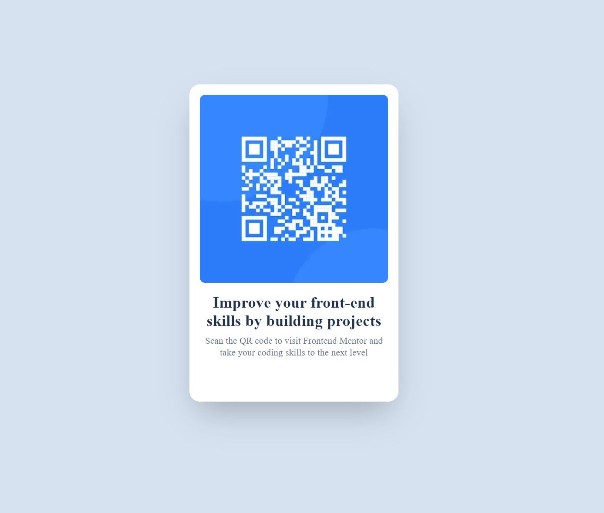

# Frontend Mentor - QR code component solution

This is a solution to the [QR code component challenge on Frontend Mentor](https://www.frontendmentor.io/challenges/qr-code-component-iux_sIO_H). Frontend Mentor challenges help you improve your coding skills by building realistic projects.

## Table of contents

- [Overview](#overview)
  - [Screenshot](#screenshot)
  - [Links](#links)
- [My process](#my-process)
  - [Built with](#built-with)
- [Author](#author)

**Note: Delete this note and update the table of contents based on what sections you keep.**

## Overview

### Screenshot

### Links

- Solution URL: [Github solution URL](https://github.com/pierrettemugisha/fm-qr-code-component)
- Live Site URL: [Live site URL](https://fm-qr-code-component-zeta.vercel.app/)

## My process

### Built with

- [React](https://reactjs.org/) - JS library
- [Next.js](https://nextjs.org/) - React framework
- [Material UI](https://mui.com/) - React component library

## Author

- Frontend Mentor - [@pierrettemugisha](https://www.frontendmentor.io/profile/pierrettemugisha)
